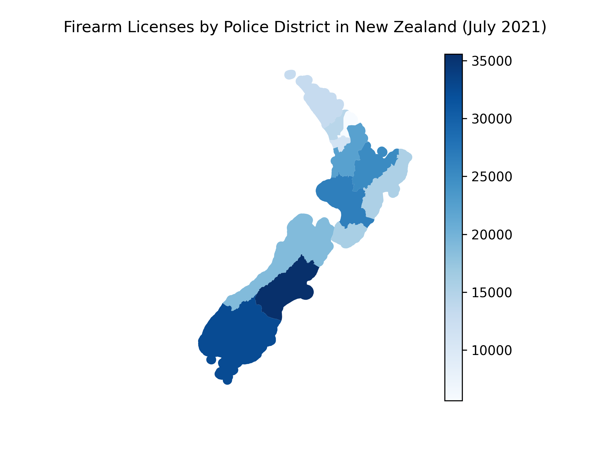

# Making Colored Maps of New Zealand with Matplotlib and Geopandas
This is the code for my Towards Data Science tutorial, where we create a map of firearm licenses among the 12 police districts of New Zealand. Data is courtesy of [Koordinates.com](https://koordinates.com/layer/3824-nz-police-district-boundaries/) and the [New Zealand Police]](https://www.police.govt.nz/about-us/publication/firearms-data).

## Requirements
* Python 2.7 or 3.x
* [Pandas](https://pandas.pydata.org/)
* [Geopandas](https://geopandas.org/)
* [Matplotlib](https://matplotlib.org/)

## References
* [Plot choropleth maps with shapefiles using Geopandas](https://towardsdatascience.com/plot-choropleth-maps-with-shapefiles-using-geopandas-a6bf6ade0a49)
* [New Zealand Police District boundaries](https://koordinates.com/layer/3824-nz-police-district-boundaries/)
* [New Zealand firearm license data](https://www.police.govt.nz/about-us/publication/firearms-data)

